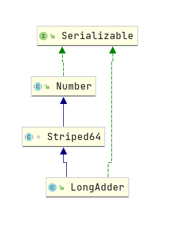

### 笔记
## 1.并发编程线程基础

### 1.1 进程与线程

线程状态：运行 阻塞 就绪  

进程是资源分配的基本单位，线程是独立调度的基本单位  
cpu资源分配给线程  
java中 main函数所在的线程是主线程  
一个进程可以有多个线程，多个线程之间共享 堆 和 方法区  
每个线程有自己独立的 程序计数器 和 栈  

### 1.2线程创建与运行
多线程的三种方式:  
  1. 继承Thread类
     * 获取当前线程直接用this(Thread.currentThread())
      * java不支持多继承，任务和代码没有分离
      * 没有返回值
  2. 实现Runnable方法
     * 没有返回值
  3. FutureTask
     * ft.get()获取返回值

### 1.3 线程通知与等待 Object
1. wait()函数  
    * 阻塞当前线程
      * 其他线程调用notify(), notifyAll()
      * 其他线程调用interrupt() 该线程抛出InterruptedException异常
    * 释放已获取的锁  
    如果调用wait()的线程没有获取该对象的监视器锁，会抛出IllegalMonitorStateException异常
    ```
    避免虚假唤醒
    synchronized(obj) {
        while (!satisfied) {
            obj.wait();
        }
    }
    ```
2. wait(long timeout)函数  
如果没有在给定时间timeout内调用notify()或者notify()唤醒，会因超时而返回  
wait(0) == wait() 传入负数 -> 抛出IllegalArgumentException  
3. wait(long timeout, int nanos)函数  
当nanos>0时, timeout递增(每次while循环都会导致等待时间增加)
    ```
    synchronized (obj) {
        while (<condition does not hold> and <timeout not exceeded>) {
            long timeoutMillis = ... ; // recompute timeout values
            int nanos = ... ;
            obj.wait(timeoutMillis, nanos);
        }
        ... // Perform action appropriate to condition or timeout
    }
   ```
4. notify()函数
   当一个线程调用共享对象的notify()方法后，会唤醒一个在该共享变量上调用wait()方法后被挂起的线程  
   一个共享变量上可能会有多个线程在等待，具体唤醒哪一个是随机的  
   被唤醒的线程要去和其他线程一起竞争该锁  
   o
5. notifyAll()函数
   会唤醒在该共享变量上由于调用wait()函数而被挂起的线程  

### 1.4 等待线程执行终止的join()方法 Thread
   void Thread.join()
   threadOne.join() // 主线程阻塞，等待threadOne返回

### 1.5 线程睡眠sleep() Thread
   让出执行权，不释放该线程拥有的监视器资源  

### 1.6 CPU让出执行权 yield() Thread
   时间片还有，不想用了，主动进入就绪状态 **其他都是阻塞**

### 1.7 线程中断
   1. void interrupt() 设置线程的中断标志位true并立刻返回  
     如果线程正在因为wait, join, sleep而被阻塞，则抛出InterruptedException异常  
   2. boolean isInterrupted() 检测当前线程是否被中断  
   3. boolean interrupted() 检测当前线程是否被中断，并清除中断标志

### 1.8 线程上下文切换
   时机：当前线程的CPU时间片用完处于就绪状态，当前线程被其他线程中断

### 1.9 线程死锁
  1. 同时符合四个条件
     1. 互斥(某项资源同一时刻只能被一个线程使用)
     2. 不可抢占(线程主动释放资源前，其他线程不能抢占)
     3. 循环等待(多个线程之间循环等待其他资源)
     4. 请求和保持(已获得资源的线程继续请求其他资源是不释放已获得的)
  2. 避免死锁
     1. 破环请求和保持 (一次性获取所有资源)
     2. 破环循环等待 (规定获取资源顺序)

### 1.10 守护线程 用户线程
   thread.setDaemon(true)  
   所有的用户线程结束后，结束JVM进程

### 1.11 ThreadLocal
   创建一个ThreadLocal变量，访问该变量的每个线程都会有一个该变量的本地副本；操作该变量时，操作的是
自己本地内存里的变量，避免线程安全问题。
#### 实现原理
Thread 里面有两个 ThreadLocalMap(threadLocals, inheritableThreadLocals)
threadLocal类型的本地变量存放在具体的线程内存空间中  
每个线程的本地变量不存放在ThreadLocal实例里面，而是存放在调用线程的threadLocals变量里面  
子线程访问父线程的变量  
```
ThreadLocal<String> local = new InheritableThreadLocal<>();
```

## 2. 并发编程

### 2.1 多线程并发编程
* 并发：一段时间内多个任务同时执行
* 并行：同一时刻多个任务同时执行
* 线程安全问题：多个线程同时读写一个共享资源且没有任何同步措施时，导致出现脏数据或其他不可预见的问题。
* Java内存模型：所有的变量都存放在主内存中，当线程使用变量时，会把主内存中的变量复制到自己的工作内存，线程读写
变量时操作的是自己工作内存中的变量，处理完后同步回主内存
* 内存可见性问题 (CPU寄存器 -> 缓存 -> 主内存)
* synchronized 监视器锁 (阻塞线程 需要从用户态 切换到 内核态)
  * 获取锁后：清空本地内存变量，全部从主内存中获取
  * 释放锁前：将本地内存的修改同步回主内存
* volatile 使用场景 (提供可见性，不保证原子性)
  * 写入值不依赖当前值
  * 读写变量时没有加锁
### 2.7 java中的原子操作
set get方法都要synchronized，来保证可见性

### 2.9 Unsafe类
Unsafe类提供硬件级别的原子操作，都是native方法  
rt.jar提供，由Bootstrap classloader加载  
main方法由 application classloader加载，因此无法直接使用(用反射)


### 2.10 指令重排序
java内存模型运行编译器和处理器对指令重排序以提高运行性能，并且只会对不存在数据依赖的指令重排序  
单线程下可以保证最终的执行结果与程序顺序执行的结果一致，多线程会存在问题  

### 2.11 伪共享
程序的局部性原理  
为了解决主内存和CPU之间运行速度差的问题，会加入一级或多级高速缓存存储器Cache  
存放到cache行中的是内存块而不是单个变量，可能会把多个变量放到一个Cache行中。当多个线程同时修改一个缓存行里的多个变量时
由于同时只能有一个线程操作缓存行，性能会有所降低，这就是伪共享  
@sun.misc.Contended解决伪共享问题

### 2.12 锁
1. 乐观锁和悲观锁：  
    1. 乐观锁：认为数据在一般情况下不会发生冲突，所以在访问记录前不会加排它锁，而是在进行数据提交更新时，才会正式对数据冲突与否进行检测  
    2. 悲观锁：对数据被外界修改持保守态度，认为数据很容易会被其他线程修改，所以，在数据被处理前先对数据进行加锁，并在整个数据处理过程中，使数据处于锁定状态  
   
2. 公平锁和非公平锁(按照获取锁的抢占机制)  
    1. 公平锁：线程获取锁的顺序按照线程请求锁的时间早晚来决定  
    2. 非公平锁：未必按顺序
    ```
        ReentrantLock lock = new RentrantLock(true); // 公平锁
        ReentrantLock lock = new RentrantLock(false); // 非公平锁
    ```
    
3. 独占锁和共享锁(按照锁只能被单个线程持有还是能被多个线程共同持有)
    1. 独占锁：保证任何时候只有一个线程能得到锁
    2. 共享锁：可以同时由多个线程持有
    ```
        ReentrantLock: 独占锁
        ReadWriteLock: 共享锁
    ```    

4. 可重入锁(当一个线程获取它自己已经获取的锁时，不会被阻塞)  
synchronized是可重入的(计数器，记录加锁次数)  
   
5. 自旋锁(当线程获取锁时，如果发现已被其他线程获取，不会马上阻塞自己，在不放弃cpu使用权的情况下，多次尝试)  

## 3. ThreadLocalRandom类原理剖析
### 3.1 Random的局限性
`nextInt(bound)`  
1. 根据老的种子生成新的种子  
2. 根据新的种子计算新的随机值  

也就是说当多个线程根据同一个老种子计算新种子时， 第一个线程的新种子被计算出来后，
第二个线程要丢弃自己老的种子，而使用第一个线程的新种子来计算自己的新种子，
依此类推，只有保证了这个，才能保证在多线程下产生的随机s数是随机的。  

每个Random 实例里面都有一个原子性的种子变量用来记录当前的种子值，当要生成新的随机数时需要根据当前种子计算新的种子并更新回原子变量。
在多线程下使用单个Random 实例生成随机数时，当多个线程同时计算随机数来计算新的种子时，
多个线程会竞争同一个原子变量的更新操作，由于原子变量的更新是CAS 操作，同时只有一个线程会成功，所以会造成大量线程进行自旋重试，
这会降低并发性能，所以ThreadLocalRandom 应运而生。  

`ThreadLocalRandom`中没有存放具体的种子，具体的种子存放在具体的调用线程的`threadLocalRandomSeed`里面  
`ThreadLocalRandom.current()` 负责初始化调用线程里的`threadLocalRandomSeed`变量，静态方法，多个线程返回同一个对象  

**ThreadLocalRandom使用ThreadLocal的原理，让每一个线程持有一个本地的种子变量，该种子变量只有在使用随机数时才会被初始化，
多线程下计算新种子时根据自己线程内维护的种子变量进行更新，避免竞争**

## 4. 原子操作类原理剖析(CAS)

### 4.1 原子变量操作类
```
AtomicInteger, AtomicLong, AtomicBoolean

incrementAndGet() -> getAndAddLong(this, valueOffset, 1L) + 1L;
decrementAndGet() -> getAndAddLong(this, valueOffset, -1L) - 1L;
getAndIncrement() -> getAndAddLong(this, valueOffset, 1L);
getAndDecrement() -> getAndAddLong(this, valueOffset, -1L);

valueOffset = unsafe.objectFieldOffset(AtomicLong.class.getDeclaredField("value"));
// value变量在AtomicLong中的偏移量 (value存放具体计数的变量 volatile(保证内存可见性))

```

### 4.2 LongAdder(原子性递增或递减类)
AtomicLong的瓶颈为 多线程竞争同一个原子变量  
LongAddr 内部维护多个Cell，争夺单个变量操作的线程量就会减少  
多个线程争夺同一个Cell原子变量失败了，并不是在当前Cell变量上一直自旋CAS重试，而是尝试在其他Cell变量上进行CAS尝试，
这个改变郑家了当前线程重试CAS成功的可能性。最后在获取LongAdder当前值时，把所有Cell变量的value值累加后加上base返回  

Cell 原子性更新数组 2^n 是一个AtomicLong的改进，解决伪共享的问题

使用@Content修饰，放置多个元素共享一个缓存行，提高性能  
  

Striped64  
1. base: long 真实值为(base + Cell[i ... n])  
2. cellsBusy: volatile int 实现自旋锁(0, 1) 创建Cell元素，扩容Cell数组或初始化Cell数组时，
   用CAS操作保证同时只有一个线程可以进行其中之一操作  
3. cells: volatile Cell[]  

  1. LongAdder的结构是怎样的?  包装一个`volatile long value`  
  2. 当前线程应该出问Cell数组里面的哪一个Cell元素? 当前线程应该访问cells 数组的哪一个Cell元素是通过getProbe() & m 进行计算的，
     其中m 是当前cells 数组元素个数－ 1 , getProbe()则用于获取当前线程中变量threadLocalRandomProbe 的值，这个值一开始为0 ，
     后面其进行初始化。  
  3. 如何初始化Cell数组? cellsBusy 是一个标示，为0说明当前cells 数组没有在被初始化或者扩容，也没有在新建Cell元素，
     为1则说明cells数组在被初始化或者扩容，或者当前在创建新的Cell 元素、通过CAS操作来进行0或1状态的切换  
  4. Cell数组如何扩容? 当前cells的元素个数小于当前机器CPU 个数并且当前多个线程访问了cells中同一个元素
     从而导致冲突使其中一个线程CAS 失败时才会进行扩容操作,将容量扩充为之前的2倍  
  5. 线程访问分配的Cell 元素有冲突后如何处理? 对CAS 失败的线程重新计算当前线程的随机值threadLocalRandomProbe,以减少下次访问cells 元素时的冲突机会  
  6. 如何保证线程操作被分配的Cell元素的原子性? cas函数通过CAS 操作，保证了当前线程更新时被分配的Cell元素中value值的原子性。
      使用@Contented避免伪共享  

### 4.3 LongAccumulator
LongAdder是LongAccumulator的一个特例  
LongAdder 只能提高默认的0值  
LongAccumulator 可以提供非0的初始值，指定累加规则  


## Java并发包中的List源码剖析(CopyOnWriteArrayList)
线程安全：进行的修改哦操作都是在底层的一个复制数组(快照)上进行的  
有一个array数组存放具体的元素，ReentrantLock(独占锁)保证同时只有一个线程对array进行修改  

### 5.2 代码解析

1. 初始化  
   无参构造函数：创建大小为0的Object数组作为array的初始值  
   参数为 E[]: 创造一个list，将传入的数组元素复制进去  
   参数为 Collection 将传入集合的元素复制进去  


2. 添加元素 `add(E e)`  
    1. 获取独占锁 `ReentrantLock`  
    2. 获取存放元素的`array`  
    3. 复制array到另一个新创建的数组(新数组的长度为原来的+1 因此是无界的)，添加新元素e到新数组  
    4. 使用新数组替换原来的  
    5. 释放独占锁  

3. 获取指定位置的元素`get(int index)`  
    1. 获取array数组  
    2. 通过下标访问指定位置的元素  

4. 修改指定位置的元素`set(int index, E element)`  
    1. 获取独占锁  
    2. 获取存放元素的array  
    3. 调用get方法获取指定位置的元素：  
       * 如果指定位置的元素值和新值不一样，新建一个数组并复制所有的元素  
       * 如果相同，为了保证volatile语义，还要重新设置array  
    4. 释放独占锁  

5. 删除元素`remove(int index)`  
    1. 获取独占锁
    2. 获取存放元素的数组array
    3. 获取指定位置的元素
    4. 新建一个数组存放元素  
       * 如果要删除的是最后一个元素：复制一次Arrays.copyOf(elements, len-1)  
       * 否则：分两次复制
    5. 使用新数组代替原来的
    6. 释放独占锁  
       
6. 弱一致性的迭代器  
COWIterator 存放数组的快照`snapshot`, 获取到给定的迭代器后，其他线程对该list的修改不可见，操作的是两个不同的数组  

## java并发包中的锁原理
1. LockSupport工具类(rt.jar)  
  该工具类用来挂起和唤醒线程，是创建锁和其他同步类的基础  
   LockSupport类与每个使用它的线程都会关联一个许可证，默认情况下调用LockSupport类的方法的线程是不持有许可证的，使用Unsafe类实现  
   
2. AbstractQueuedSynchronizer 抽象同步队列  
  FIFO双向队列，通过节点(Node) head 和tail 记录队首和队尾  
   thread变量用来存放进入AQS队列里的线程；
   shared用来标记该线程是获取共享资源时被阻塞挂起后放入AQS队列的；
   exclusive用来标记线程时获取独占资源时被挂起后放入AQS队列的；
   waitStatus记录当前线程等待状态
     * cancelled 线程被取消
     * signal 线程需要被唤醒
     * condition 线程在条件队列里等待
     * propagate 释放共享资源时需要通知其他节点
   prev记录当前节点的前驱节点；
   next记录当前节点的后继节点
       
   维护一个单一的状态信息：state
     * ReentrantLock 当前线程获取锁的可重入次数
     * ReentrantReadWriteLock 高16位表示读状态(获取读锁的次数)，低16为表示获取到写锁线程的可重入次数  
     * Semaphore 当前可以信号个数
     * CountDownlatch 当前计数器的值
    


